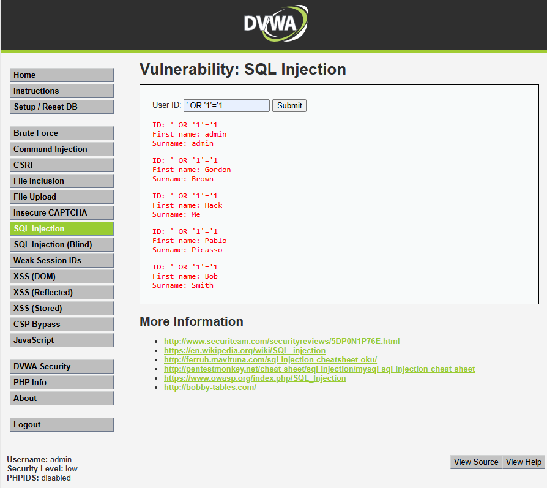
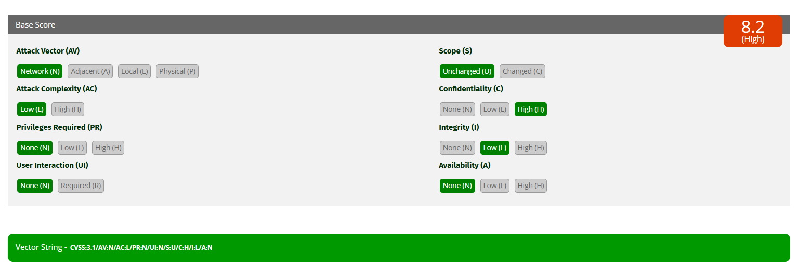

# Inyección SQL — SeguroTotal

## 1. Descripción del hallazgo

La vulnerabilidad de Inyección SQL fue identificada en el módulo **SQL Injection** de DVWA. Esta falla permite manipular la consulta que la aplicación realiza a la base de datos mediante el ingreso de texto malicioso en un campo controlado por el usuario.

En el contexto de SeguroTotal, una vulnerabilidad de este tipo podría permitir la exposición de información relacionada con clientes, pólizas, contratos, datos patrimoniales y antecedentes asociados a seguros generales.

## 2. Evidencia del ataque

**Payload utilizado:**

```sql
' OR '1'='1
```

**Resultado observado:**  
La aplicación devolvió múltiples registros de usuarios, demostrando que el campo vulnerable permitió modificar la lógica de la consulta SQL.



## 3. Explicación técnica

La vulnerabilidad ocurre porque la aplicación recibe la entrada del usuario y la concatena directamente dentro de una consulta SQL. Al ingresar el payload `' OR '1'='1`, la comilla inicial cierra la cadena esperada por la consulta, y la condición `OR '1'='1'` fuerza que la evaluación sea verdadera para todos los registros.

Una consulta vulnerable podría quedar conceptualmente así:

```sql
SELECT first_name, surname FROM users WHERE user_id = '' OR '1'='1';
```

Como `'1'='1'` siempre es verdadero, la base de datos devuelve todos los registros que coinciden con esa condición. En un portal real de SeguroTotal, esto podría traducirse en acceso no autorizado a datos de clientes, pólizas y antecedentes patrimoniales.

## 4. Cálculo CVSS 3.1

**Puntaje CVSS:** 8.2  
**Severidad:** High  
**Vector:** `CVSS:3.1/AV:N/AC:L/PR:N/UI:N/S:U/C:H/I:L/A:N`



### Justificación del CVSS

| Métrica | Valor | Justificación |
|---|---|---|
| AV | Network | El ataque se ejecuta desde la aplicación web. |
| AC | Low | El payload es simple y no requiere condiciones complejas. |
| PR | None | No requiere privilegios especiales en el sistema. |
| UI | None | No necesita interacción de otra persona. |
| S | Unchanged | El impacto se mantiene dentro del mismo sistema vulnerable. |
| C | High | Puede exponer información sensible de clientes y pólizas. |
| I | Low | Podría permitir alteración limitada de consultas o datos. |
| A | None | En esta prueba no se evidenció interrupción del servicio. |

## 5. Impacto para SeguroTotal

La inyección SQL representa un riesgo crítico para SeguroTotal porque el portal custodia información relevante para clientes y contratos de seguros. Una explotación real podría provocar:

- Exposición masiva de datos de clientes.
- Filtración de pólizas y antecedentes patrimoniales.
- Uso indebido de información contractual.
- Pérdida de confianza de clientes.
- Posible daño legal, reputacional y operacional.

## 6. Política de prevención

SeguroTotal debe establecer una política de desarrollo seguro que prohíba la concatenación directa de entradas de usuario en consultas SQL. Toda consulta a base de datos debe implementarse mediante consultas parametrizadas o prepared statements.

La política debe exigir:

- Uso obligatorio de consultas parametrizadas.
- Validación estricta de tipos de datos.
- Revisión de código antes de pasar a producción.
- Pruebas de seguridad en formularios, filtros y parámetros de URL.
- Principio de mínimo privilegio para cuentas de base de datos.