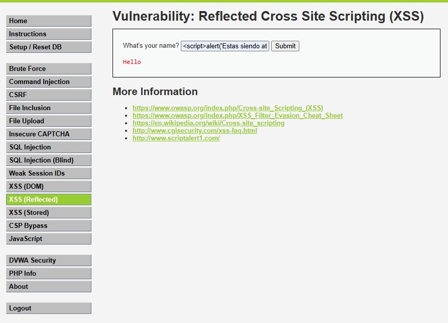
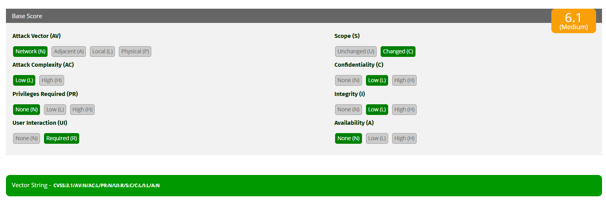

# XSS Reflected — SeguroTotal

## 1. Descripción del hallazgo

La vulnerabilidad XSS Reflected fue identificada en el módulo **XSS (Reflected)** de DVWA. Esta falla ocurre cuando la aplicación recibe una entrada del usuario y la devuelve en la respuesta HTML sin validarla ni escaparla correctamente.

En el contexto de SeguroTotal, esta vulnerabilidad podría ser utilizada para engañar a clientes, robar sesiones, redirigir a sitios falsos o mostrar contenido manipulado en el portal de seguros.

## 2. Evidencia del ataque

**Payload utilizado:**

```html
<script>alert('XSS')</script>
```

**Resultado observado:**  
La aplicación reflejó la entrada del usuario en la página. En un escenario vulnerable, el navegador interpreta el contenido como código JavaScript, permitiendo la ejecución de scripts dentro de la sesión del usuario.



## 3. Explicación técnica

XSS Reflected funciona porque el servidor incluye la entrada del usuario dentro del HTML de respuesta sin neutralizar caracteres especiales como `<`, `>`, `'` o `"`. Cuando el navegador recibe esa respuesta, interpreta la etiqueta `<script>` como parte del código de la página y no como texto común.

Un ejemplo simplificado sería:

```html
<p>Hello <script>alert('XSS')</script></p>
```

El navegador no distingue si ese código fue escrito por el desarrollador o ingresado por un atacante. Por eso, si el portal de SeguroTotal mostrara búsquedas, nombres o mensajes sin escapar correctamente, un atacante podría construir enlaces maliciosos para afectar a clientes o funcionarios.

## 4. Cálculo CVSS 3.1

**Puntaje CVSS:** 6.1  
**Severidad:** Medium  
**Vector:** `CVSS:3.1/AV:N/AC:L/PR:N/UI:R/S:C/C:L/I:L/A:N`



### Justificación del CVSS

| Métrica | Valor | Justificación |
|---|---|---|
| AV | Network | El ataque se realiza mediante la aplicación web. |
| AC | Low | El payload es simple y fácil de construir. |
| PR | None | No requiere privilegios especiales. |
| UI | Required | Requiere que la víctima abra o interactúe con la página/enlace. |
| S | Changed | El impacto afecta el contexto del navegador del usuario. |
| C | Low | Puede exponer datos de sesión o información visible. |
| I | Low | Puede modificar lo que el usuario ve o envía. |
| A | None | No se evidencia interrupción directa del servicio. |

## 5. Impacto para SeguroTotal

Aunque el puntaje CVSS es menor que en SQL Injection y Command Injection, XSS sigue siendo relevante para SeguroTotal. Un ataque real podría permitir:

- Robo de cookies o tokens de sesión.
- Suplantación de clientes.
- Redirección hacia portales falsos.
- Captura de credenciales mediante formularios fraudulentos.
- Daño reputacional por manipulación del portal.
- Engaño a usuarios que consultan pólizas o información contractual.

## 6. Política de prevención

SeguroTotal debe definir una política de validación y codificación de salida para todo dato ingresado por usuarios. La aplicación nunca debe insertar texto del usuario directamente en el HTML sin aplicar escape o sanitización.

La política debe exigir:

- Escapar toda salida HTML.
- Sanitizar entradas en formularios, buscadores y parámetros de URL.
- Aplicar Content Security Policy (CSP).
- Evitar JavaScript inline.
- Usar frameworks y librerías que escapen contenido por defecto.
- Realizar pruebas de seguridad sobre campos que reflejen datos.

## 7. Controles de mitigación

Como controles de mitigación se recomienda:

- Configurar cabeceras de seguridad HTTP.
- Implementar CSP para restringir scripts no autorizados.
- Usar cookies con atributos `HttpOnly`, `Secure` y `SameSite`.
- Monitorear URLs con patrones sospechosos como `<script>`.
- Bloquear intentos repetidos mediante WAF.
- Capacitar a usuarios internos para detectar enlaces sospechosos.

## 8. Prioridad de corrección

La prioridad de corrección es **alta**, porque aunque requiere interacción del usuario, puede facilitar suplantación y robo de sesión. En una empresa de seguros generales, esto puede permitir acceso indebido a pólizas, datos de clientes y operaciones dentro del portal.