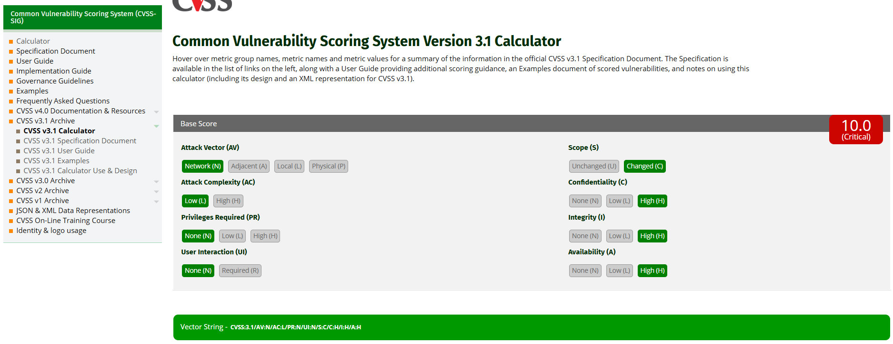

# Inyección de Comandos — SeguroTotal

## 1. Descripción del hallazgo

La vulnerabilidad de Inyección de Comandos fue identificada en el módulo **Command Injection** de DVWA. Esta falla permite que una entrada del usuario sea interpretada como parte de un comando del sistema operativo.

En SeguroTotal, una vulnerabilidad de este tipo sería extremadamente grave, ya que podría comprometer el servidor donde opera el portal de clientes, afectando la confidencialidad, integridad y disponibilidad de la plataforma.

## 2. Evidencia del ataque

**Payload utilizado:**

```bash
127.0.0.1; cat /etc/passwd
```

**Resultado observado:**  
La aplicación ejecutó el ping a `127.0.0.1` y además mostró el contenido del archivo `/etc/passwd`, evidenciando que el servidor aceptó y ejecutó un segundo comando.


## 3. Explicación técnica

La vulnerabilidad ocurre porque la aplicación construye un comando del sistema usando directamente la entrada del usuario. En este caso, la función esperada era ejecutar un ping a una dirección IP, pero el uso del carácter `;` permitió encadenar una segunda instrucción.

Conceptualmente, la ejecución queda así:

```bash
ping 127.0.0.1; cat /etc/passwd
```

El sistema interpreta el `;` como una separación entre comandos. Primero ejecuta el ping y luego ejecuta `cat /etc/passwd`, que muestra información de cuentas del sistema Linux.

En un entorno real de SeguroTotal, esta vulnerabilidad podría permitir lectura de archivos internos, modificación de configuraciones, instalación de software malicioso o interrupción del portal.

## 4. Cálculo CVSS 3.1

**Puntaje CVSS:** 10.0  
**Severidad:** Critical  
**Vector:** `CVSS:3.1/AV:N/AC:L/PR:N/UI:N/S:C/C:H/I:H/A:H`



### Justificación del CVSS

| Métrica | Valor | Justificación |
|---|---|---|
| AV | Network | El ataque se realiza desde la aplicación web. |
| AC | Low | El payload es simple y directo. |
| PR | None | No requiere privilegios previos. |
| UI | None | No necesita interacción de otra víctima. |
| S | Changed | El impacto puede extenderse desde la aplicación al sistema operativo. |
| C | High | Puede permitir lectura de archivos sensibles. |
| I | High | Puede permitir modificación o eliminación de archivos. |
| A | High | Puede afectar la disponibilidad del servidor. |

## 5. Impacto para SeguroTotal

La inyección de comandos es el hallazgo más crítico de la auditoría. En el contexto de SeguroTotal, una explotación real podría generar:

- Compromiso completo del servidor web.
- Acceso a archivos internos.
- Robo de datos de clientes y pólizas.
- Alteración de información contractual.
- Caída del portal de clientes.
- Instalación de malware o puertas traseras.
- Pérdida de continuidad operacional.

## 6. Política de prevención

SeguroTotal debe prohibir que las aplicaciones web ejecuten comandos del sistema operativo utilizando entradas directas del usuario. Si se requiere una función técnica como ping, debe implementarse mediante APIs seguras y con validación estricta.

La política debe exigir:

- No invocar shell del sistema con datos ingresados por usuarios.
- Validar entradas mediante listas blancas.
- Aceptar únicamente formatos permitidos, por ejemplo IPv4 válida.
- Ejecutar servicios con cuentas de bajo privilegio.
- Revisar código que use funciones como `system`, `exec`, `shell_exec` o similares.
- Realizar pruebas de seguridad antes de desplegar cambios.

## 7. Controles de mitigación

Como controles de mitigación se recomienda:

- Restringir permisos del usuario del servidor web.
- Usar contenedores o aislamiento del servicio.
- Implementar monitoreo de comandos sospechosos.
- Bloquear caracteres peligrosos como `;`, `&&`, `|`, `$()` cuando no sean necesarios.
- Configurar WAF con reglas contra command injection.
- Mantener respaldos offline y restaurables.
- Revisar logs del sistema operativo y de la aplicación.

## 8. Prioridad de corrección

La prioridad de corrección es **crítica e inmediata**. Esta vulnerabilidad puede comprometer el servidor completo, por lo que debe ser tratada antes que cualquier mejora visual o funcional del portal.
