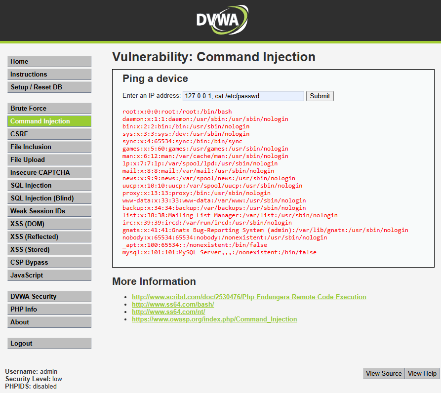

# Inyección de Comandos — SeguroTotal

## 1. Descripción del hallazgo

La vulnerabilidad de Inyección de Comandos fue identificada en el módulo **Command Injection** de DVWA. Esta falla permite que una entrada del usuario sea interpretada como parte de un comando del sistema operativo.

En SeguroTotal, una vulnerabilidad de este tipo sería extremadamente grave, ya que podría comprometer el servidor donde opera el portal de clientes, afectando la confidencialidad, integridad y disponibilidad de la plataforma.

## 2. Evidencia del ataque

**Payload utilizado:**

```bash
127.0.0.1; cat /etc/passwd
```

**Resultado observado:**  
La aplicación ejecutó el ping a `127.0.0.1` y además mostró el contenido del archivo `/etc/passwd`, evidenciando que el servidor aceptó y ejecutó un segundo comando.

